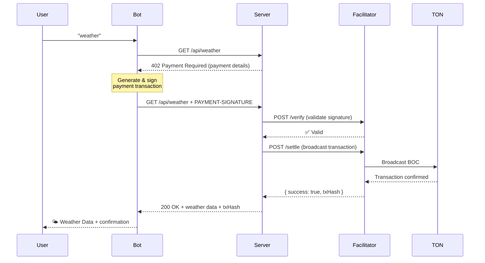

# BSA x TON - x402 Payment Protocol with Telegram Bot

A complete implementation of the **x402 protocol** (HTTP 402 Payment Required) on the **TON blockchain**, featuring a **Telegram Bot** interface for seamless micropayments. Built for the BSA x TON Stablecoins & Payments Hackathon.

This starter provides a **fully working pay-per-use API infrastructure** with a Telegram bot frontend, allowing users to make payments and receive data directly in Telegram chats using **BSA USD** stablecoin on TON testnet.

**Built by**: [Stan](https://github.com/hliosone) and [Loris](https://github.com/Loris-EPFL) from BSA  
**Questions?**: Reach out to Loris

---

## 🎯 What's Inside

- **Telegram Bot** - Natural language interface for x402 payments
- **Next.js API Server** - Payment-protected endpoints
- **x402 Protocol** - HTTP 402 Payment Required implementation
- **TON Integration** - BSA USD Jetton payments on TON blockchain
- **Built-in Facilitator** - Transaction verification and settlement

---

## 🛠 Tech Stack

This is a **pnpm monorepo** built with:

- **[TypeScript](https://www.typescriptlang.org/)** - Type-safe development
- **[Next.js 15](https://nextjs.org/)** - API server with App Router
- **[TON SDK](https://github.com/ton-org/ton)** - Blockchain interactions (`@ton/ton`, `@ton/core`, `@ton/crypto`)
- **[Telegram Bot API](https://core.telegram.org/bots/api)** - Bot interface
- **[pnpm](https://pnpm.io/)** - Fast, disk space efficient package manager
- **BSA USD** - TEP-74 Jetton stablecoin on TON testnet

---

## 📁 Project Structure

```
bsa-sp-template-x402-2026/
├── packages/
│   ├── core/           # Protocol types, headers, encoding utilities
│   ├── client/         # x402Fetch - automated payment flow handler
│   ├── middleware/     # paymentGate - Next.js route protection
│   └── facilitator/    # Transaction verification & settlement
│
└── examples/
    ├── nextjs-server/  # API server with payment-protected routes
    │   ├── app/api/
    │   │   ├── weather/        # Weather data endpoint (0.01 BSA USD)
    │   │   ├── joke/           # Developer jokes (0.01 BSA USD)
    │   │   └── facilitator/    # Built-in facilitator service
    │   └── .env.local          # Configuration file
    │
    └── client-script/  # Payment client & Telegram bot
        ├── src/
        │   ├── telegram-bot.ts # Telegram bot implementation
        │   └── pay.ts          # CLI payment script
        ├── start-bot.sh        # Bot startup script (WSL)
        ├── start-bot.ps1       # Bot startup script (PowerShell)
        ├── TELEGRAM_BOT_README.md
        └── TROUBLESHOOTING.md
```

### 📦 Packages Overview

| Package | Description |
|---------|-------------|
| **@ton-x402/core** | Protocol types, header encoding/decoding, TON utilities |
| **@ton-x402/client** | `x402Fetch()` - Handles 402 → sign → retry flow automatically |
| **@ton-x402/middleware** | `paymentGate()` - Wraps Next.js routes with payment verification |
| **@ton-x402/facilitator** | Verification & settlement handlers for transactions |

---

## 🚀 Quick Start

### Prerequisites

**Required for everyone:**
- [Node.js](https://nodejs.org/) >= 18
- [pnpm](https://pnpm.io/) - Install: `npm i -g pnpm`
- [WSL](https://docs.microsoft.com/en-us/windows/wsl/install) (Windows users) - Required for running the bot
- [Toncenter API key](https://toncenter.com) - Free API key
- TON wallet address (for receiving payments)

**For Telegram Bot (optional but recommended):**
- Telegram Bot Token (create via [@BotFather](https://t.me/botfather))
- TON testnet wallet with 24-word mnemonic
- Testnet funds (TON for gas, BSA USD for payments)

---

### 1️⃣ Clone & Install

```bash
git clone git@github.com:bsaepfl/bsa-sp-template-x402-2026.git
cd bsa-sp-template-x402-2026
pnpm install
pnpm build
```

---

### 2️⃣ Configure Environment

```bash
cd examples/nextjs-server
cp .env.example .env.local
```

Edit `.env.local`:

```env
# Network configuration
TON_NETWORK=testnet

# Server wallet (receives payments) - ADDRESS ONLY, no private key needed
PAYMENT_ADDRESS=0QB_twkoUKiLUFxXIZ0n0hIo75-jOIVLALnp3GimcBPR0Sxa

# BSA USD Jetton master contract (testnet)
JETTON_MASTER_ADDRESS=kQCd6G7c_HUBkgwtmGzpdqvHIQoNkYOEE0kSWoc5v57hPPnW

# Facilitator endpoint (built-in)
FACILITATOR_URL=http://localhost:3000/api/facilitator

# TON RPC endpoint
TON_RPC_URL=https://testnet.toncenter.com/api/v2/jsonRPC
RPC_API_KEY=your_toncenter_api_key_here

# Client wallet (sends payments) - 24-WORD MNEMONIC
# Used by bot and CLI scripts to make payments
WALLET_MNEMONIC="word1 word2 word3 ... word24"
```

> **Important**: 
> - `PAYMENT_ADDRESS` = Where your server **receives** payments (public address only)
> - `WALLET_MNEMONIC` = Bot's wallet that **sends** payments (private key needed)

---

### 3️⃣ Get Testnet Funds

Your bot's wallet (from `WALLET_MNEMONIC`) needs:

**Testnet TON** (for gas):
```
Telegram: @testgiver_ton_bot
```

**Testnet BSA USD** (for payments):
```
Faucet: https://ton-x402-nextjs-server-dyvpwctew-hliosones-projects.vercel.app/
```

---

### 4️⃣ Start the API Server

From repo root:

```bash
pnpm dev
```

✅ Server running at: `http://localhost:3000`

---

### 5️⃣ Start the Telegram Bot

**Option A: Using WSL (Recommended)**

```bash
cd examples/client-script
bash start-bot.sh
```

**Option B: Using PowerShell**

```powershell
cd examples/client-script
.\start-bot.ps1
```

**Option C: Direct command**

```bash
cd examples/client-script
npx tsx --env-file=../nextjs-server/.env.local src/telegram-bot.ts
```

You should see:

```
🤖 Starting Telegram Bot...
📱 Bot Token: 8449323987...
✅ Bot connected: @YourBotName
👤 Bot name: YourBot
🔄 Listening for messages...
```

---

### 6️⃣ Test the Bot

1. Open your bot in Telegram: `https://t.me/YourBotName`
2. Send `/start` to see the welcome message
3. Send `weather` to trigger a payment and get weather data

**Expected flow:**

```
You: weather

Bot: ⏳ Fetching weather data and processing payment...
     Please wait...

Bot: 🌤️ Weather Data
     
     📍 Location: Lausanne, Switzerland
     🌡️ Temperature: 22°C
     ☁️ Conditions: Partly cloudy
     💧 Humidity: 45%
     🕐 Time: 3/21/2026, 8:36:07 PM
     
     ✅ Payment Confirmed
     🔗 Transaction Hash: 81c052bd873ab925c303daf2d07f32973452747fd4a7c2f445d3e38887476d7c
     🌐 Network: testnet
```

---

## 💬 Bot Commands

| Command | Description |
|---------|-------------|
| `/start` | Welcome message and usage instructions |
| `/help` | Help information about the bot |
| `weather` or `/weather` | Get weather data (costs 0.01 BSA USD) |

---

## 🔄 How It Works

### Architecture Overview

```
┌─────────────┐      ┌─────────────┐      ┌─────────────┐      ┌─────────────┐
│   Telegram  │      │     Bot     │      │ API Server  │      │ TON Network │
│    User     │◄────►│  (Client)   │◄────►│ (Next.js)   │◄────►│ (Testnet)   │
└─────────────┘      └─────────────┘      └─────────────┘      └─────────────┘
                            │                      │
                            │                      │
                            └──────────────────────┘
                                   Facilitator
```

### Payment Flow



---

## 🔧 Advanced Usage

### Testing with CLI (Without Bot)

```bash
# Test weather endpoint
pnpm dev:client

# Test joke endpoint
pnpm dev:client:joke
```

### Adding New Payment-Protected Routes

**Server side** (`app/api/my-endpoint/route.ts`):

```typescript
import { paymentGate } from "@ton-x402/middleware";
import { getPaymentConfig } from "../../../lib/payment-config";

const handler = (_request: Request) => {
    return Response.json({ 
        message: "This is premium content!",
        secret: "Only available after payment"
    });
};

export const GET = paymentGate(handler, {
    config: getPaymentConfig({
        amount: "10000000",  // 0.01 BSA USD (9 decimals)
        asset: process.env.JETTON_MASTER_ADDRESS,
        description: "Premium content (0.01 BSA USD)",
        decimals: 9,
    }),
});
```

**Add bot command** (in `telegram-bot.ts`):

```typescript
if (text === "premium" || text === "/premium") {
    await sendMessage(chatId, "⏳ Fetching premium content...");
    
    const result = await getDataFromEndpoint("http://localhost:3000/api/my-endpoint");
    // Handle response...
}
```

---

## 📋 Available Scripts

Run from **repo root**:

| Command | Description |
|---------|-------------|
| `pnpm install` | Install all dependencies |
| `pnpm build` | Build all packages |
| `pnpm dev` | Start Next.js server (`localhost:3000`) |
| `pnpm dev:bot` | Start Telegram bot |
| `pnpm dev:client` | Test CLI payment (weather) |
| `pnpm dev:client:joke` | Test CLI payment (joke) |
| `pnpm address` | Show wallet address formats |
| `pnpm clean` | Delete build output |
| `pnpm typecheck` | Run TypeScript checks |

---

## 🐛 Troubleshooting

### Bot Not Responding

1. Check if bot is running: `ps aux | grep telegram-bot`
2. Verify server is running: `curl http://localhost:3000`
3. Check bot token is correct in code
4. View logs in terminal where bot is running

### Duplicate Messages

If receiving multiple replies:
- **Cause**: Multiple bot instances running
- **Fix**: Run `pkill -f telegram-bot` then restart

### Payment Failed

- Verify wallet has sufficient TON (for gas)
- Check wallet has BSA USD tokens
- Confirm `PAYMENT_ADDRESS` is correct
- Ensure facilitator service is running

See `examples/client-script/TROUBLESHOOTING.md` for detailed troubleshooting.

---

## 🌐 API Endpoints

### Payment-Protected Routes

| Endpoint | Price | Description |
|----------|-------|-------------|
| `GET /api/weather` | 0.01 BSA USD | Weather data for Lausanne |
| `GET /api/joke` | 0.01 BSA USD | Random developer joke |

### Facilitator Endpoints

| Endpoint | Method | Purpose |
|----------|--------|---------|
| `/api/facilitator/verify` | POST | Validate signed BOC offline |
| `/api/facilitator/settle` | POST | Broadcast transaction and confirm |

---

## 🔐 Security Notes

⚠️ **Important Security Practices:**

- **Never commit** `.env.local` to version control
- Keep your **Bot Token** secure
- Protect your **wallet mnemonic** (never share it)
- Use environment variables for all sensitive data
- In production, deploy facilitator as separate service
- Use webhooks instead of polling in production

---

## 📚 Documentation

- **Telegram Bot**: `examples/client-script/TELEGRAM_BOT_README.md`
- **Troubleshooting**: `examples/client-script/TROUBLESHOOTING.md`
- **Translation Guide**: `examples/client-script/TRANSLATION_SUMMARY.md`

---

## 🔗 Useful Resources

### TON Ecosystem
- [TON Documentation](https://docs.ton.org)
- [Toncenter API](https://toncenter.com) - RPC endpoint & API key
- [Tonkeeper Wallet](https://tonkeeper.com) - Testnet-enabled wallet
- [TEP-74 Jetton Standard](https://github.com/ton-blockchain/TEPs/blob/master/text/0074-jettons-standard.md)

### Testnet Faucets
- **TON**: [@testgiver_ton_bot](https://t.me/testgiver_ton_bot)
- **BSA USD**: [Faucet](https://ton-x402-nextjs-server-dyvpwctew-hliosones-projects.vercel.app/)

### Telegram
- [Bot API Documentation](https://core.telegram.org/bots/api)
- [BotFather](https://t.me/botfather) - Create & manage bots
- [Bot Updates](https://core.telegram.org/bots/api#getting-updates) - Polling vs Webhooks

### BSA
- [BSA Website](https://bsaepfl.ch)
- [BSA GitHub](https://github.com/bsaepfl)

---

## 🎯 What is x402?

**x402** is an open protocol for **machine-to-machine HTTP micropayments**:

1. **Client requests** a protected resource
2. **Server responds** with `402 Payment Required` + payment instructions
3. **Client signs** a payment transaction locally (offline)
4. **Client retries** with signed transaction attached
5. **Facilitator verifies** signature and broadcasts to blockchain
6. **Server unlocks** resource after payment confirmation

**Key Benefits:**
- ✅ No wallet popups or browser extensions
- ✅ No user interaction required
- ✅ Perfect for APIs and automation
- ✅ Cryptographically secure
- ✅ On-chain settlement with proof

---

## 📊 Environment Variables

| Variable | Required | Description |
|----------|----------|-------------|
| `TON_NETWORK` | ✅ | `testnet` or `mainnet` |
| `PAYMENT_ADDRESS` | ✅ | Server wallet (receives payments) |
| `JETTON_MASTER_ADDRESS` | ✅ | BSA USD contract address |
| `FACILITATOR_URL` | ⚠️ | Facilitator endpoint (defaults to built-in) |
| `TON_RPC_URL` | ⚠️ | Toncenter RPC (defaults to testnet) |
| `RPC_API_KEY` | ⚠️ | API key (recommended to avoid rate limits) |
| `WALLET_MNEMONIC` | ✅* | Bot/client wallet (24 words) - *only for bot/CLI |

---

## 🚀 Production Deployment

### Recommended Architecture

```
┌──────────────┐     ┌──────────────┐     ┌──────────────┐
│  Telegram    │────►│   Bot Server │────►│  API Server  │
│  (Frontend)  │     │  (Railway)   │     │  (Vercel)    │
└──────────────┘     └──────────────┘     └──────────────┘
                              │                    │
                              │                    │
                              ▼                    ▼
                     ┌──────────────┐     ┌──────────────┐
                     │ Facilitator  │     │ TON Mainnet  │
                     │  (Railway)   │     │              │
                     └──────────────┘     └──────────────┘
```

### Deployment Tips

1. **API Server** → Vercel, Netlify, or Railway
2. **Bot** → Railway (24/7 uptime needed)
3. **Facilitator** → Separate service (security)
4. **Use Webhooks** instead of polling for bot
5. **Switch to mainnet** for production
6. **Secure environment variables** in deployment platform

---

## 📄 License

MIT

---

## 🙏 Credits

Built with ❤️ by [Stan](https://github.com/hliosone) and [Loris](https://github.com/Loris-EPFL) for the BSA x TON Hackathon.

---

## 🆘 Support

- **Issues**: Open an issue on GitHub
- **Questions**: Contact Loris
- **Documentation**: Check the `/examples/client-script/` docs
- **Community**: Join the BSA Discord

---

**Happy Hacking! 🚀**
