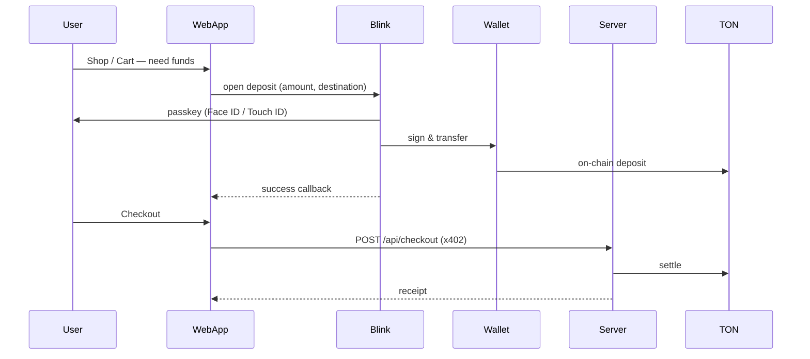
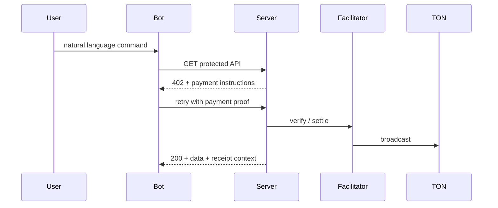

# Wisemanager: Autonomous Agent Commerce on TON

**Empowering the next generation of AI-driven marketplaces through the x402 protocol on TON.**

[](https://ton.org/)
[](https://github.com/coinbase/x402)
[](LICENSE)

**[Website — Coming Soon](#)** · **[Live Demo Bot](https://t.me/Wisemanagersbot)** · **[Blink Deposits](https://blink.cash/)** · **[Engineering appendix](#appendix-engineering--operations)** · **[Pitch deck (Canva)](https://canva.link/mau0khv02c1w0nv)**

---

Wisemanager is **social and agent-ready commerce infrastructure on TON**. We combine the **x402 protocol** with **BSA USD / TON** settlement so users on super-apps like Telegram get **chat-to-checkout** and **automation-friendly micropayments**—humans, **AI agents**, bots, and APIs can complete paid delivery **without repeated wallet popups**.

On the Web app, **[Blink](https://blink.cash/)** adds a **one-tap deposit layer**: users create a **Blink ID** (passkey), link a wallet once, then fund their balance with **Face ID / Touch ID**—no manual address copy-paste—before **TonConnect** checkout and **x402** settlement kick in.

---

## Achievements

| Milestone | Detail |
|-----------|--------|
| **BSA × EPFL Hackathon** | **3rd Place** — Stablecoins & Payments track |
| **Technical** | x402 payment gates live on **TON testnet** (market data, checkout, bot purchases, listing fee) |
| **Product** | End-to-end flows validated: natural-language **market → buy**, **sell** listing wizard, **Web Shop / Cart / Dashboard** with receipt sync |
| **Payments** | **[Blink](https://blink.cash/) one-tap deposits** on Web Shop / Cart — passkey-funded wallet top-ups before x402 checkout |

---

## Why Wisemanager? (What problem we solve)

### 1. Smart matching & agent-ready commerce

Traditional e‑commerce depends on fixed search boxes and forms. Wisemanager lets users state intent in **natural language** inside Telegram; the system parses category, price band, location, and tags, and returns shoppable candidates—the same APIs can be called by an **AI agent**, closing the loop from **plain language → pay → result**.

### 2. Frictionless micropayments (x402 + Blink)

Web3 commerce is often blocked by “open the wallet again.” x402 turns **HTTP 402** into an executable payment instruction: **client / bot** signs, retries, and settles automatically—ideal for **API metering, pay-per-use content, and bot commerce**. Wisemanager implements this on TON with **BSA USD (Jetton)** and related asset configs for hackathon and experimental deployments.

**[Blink](https://blink.cash/)** closes the **deposit gap** on Web: users set up once (Blink ID + linked wallet), then **deposit in one tap** with passkey auth—faster than manual transfers and complementary to **TonConnect** at checkout. Funds never move without the user; Blink is a funding interface, not a custodial wallet ([docs](https://docs.blink.cash/)).

### 3. Traceable transactions (trust & transparency)

Every gated payment leaves auditable context. The **Dashboard** unifies purchases, sales, and source (Bot / Web) so buyers and sellers see cash flow in one view—laying groundwork for **reputation, dispute resolution, and B2B settlement** later.

---

## Core value props (impact, not only features)

| **AI-agent commerce** | **x402 micropayments** | **Blink one-tap deposits** | **Trustless reputation** |
|------------------------|-------------------------|------------------------------|---------------------------|
| Natural language bridges humans and structured APIs: **conversation is search**, search can **pay**, shrinking intent-to-order friction. | Payment instructions live in **REST**: 402 → sign → retry → settle—built for **low-latency, small-ticket, highly automated** machine economies. | **[Blink](https://blink.cash/)** passkey deposits fund wallets in seconds—**set up once, deposit forever**, with optional cashback—so checkout never stalls on “insufficient balance.” | Trades and receipts are accounted for and tied to seller / buyer labels—foundation for **open-market governance**. |

---

## Why now?

- **900M+ native distribution** — Telegram is one of the largest open chat distribution channels; **conversational UI** is the next front for commerce and support.
- **The payment gap** — LLMs and agents can persuade users but lack a **machine-executable, reconcilable, evolvable** payment standard; **x402 + on-chain settlement** closes the last mile for the API economy.
- **TON’s fit** — Low-friction activation and mini-app ecosystems let **social + payments + digital goods** close the loop on one chain.

---

## Product demo

[](https://youtu.be/_iTJZTHn_Sc)

*~60s story: natural-language `market` → `buy`, `sell` listing, **Blink deposit** → Web Shop checkout, Dashboard receipt sync.*

---

## Technical architecture (30-second version for reviewers)

### x402 on TON (conceptual flow)

1. **Request** — Client / bot calls a protected resource (e.g. `/api/market`).
2. **Challenge** — Server returns **402 Payment Required** with payment metadata (amount, asset, pay-to address).
3. **Execution** — Client-side wallet keys sign offline; client **retries** with payment proof.
4. **Settlement** — Facilitator verifies and broadcasts; resource unlocks after confirmation.

### Blink deposits on Web (funding layer)

Before x402 checkout, users can top up via **[Blink](https://blink.cash/)**:

1. **Blink ID** — User creates a passkey tied to them (not the app, not Blink).
2. **Link wallet** — Connect any supported wallet once; user sets assets and limits.
3. **One-tap deposit** — Blink SDK modal routes funds to the connected **TonConnect** address; passkey required every time.
4. **Checkout** — Funded wallet completes **Cart → `/api/checkout`** x402 settlement as usual.





### Product surface today

| Surface | What it proves |
|---------|----------------|
| **Telegram Bot** | NL `market` / `buy` / `sell` + automated x402 payments |
| **Web app** | Glassmorphic **Shop**, **Cart**, **Dashboard**; **Blink deposit button**; TonConnect; server-side checkout proxy |
| **Blink funding** | Passkey one-tap deposits into the user’s connected wallet—no manual address / chain UI to build ([Blink docs](https://docs.blink.cash/)) |
| **Shared state** | Demo-grade in-memory receipts / listings (swap for a database in production) |

---

## Roadmap & market

| Horizon | Focus |
|---------|--------|
| **Q2 2026** | Southeast Asia **quick commerce** pilots; **Blink** deposit routing for multi-chain top-ups into TON checkout |
| **Q3 2026** | **AI-agent SDK** — standardized **intent → quote → pay** adapter for third parties |
| **Q4 2026** | Integrations with **TON Society–style reputation** — map completed trades to composable identity |

---

## Contact & community

- **Telegram Bot:** [@Wisemanagersbot](https://t.me/Wisemanagersbot)
- **Founder:** *[Shenghuei LIN]*
- **Email:** *[shenghuei1102@gmail.com]*

**Cover asset:** repository image at [`docs/screen.png`](docs/screen.png) (also used at the top of this README).

---

# Appendix: Engineering & operations

Everything below is for engineers and deep technical review—investors can stop above.

## Tech stack

TypeScript · Next.js 15 (App Router) · TON SDK · Telegram Bot API · **[Blink Deposit SDK](https://docs.blink.cash/)** · pnpm monorepo · `@ton-x402/*` (core / client / middleware / facilitator)

## Monorepo layout (short)

```text
packages/          → core, client, middleware, facilitator
examples/
  nextjs-server/   → Web UI + API routes + payment gates
  client-script/   → Telegram bot + CLI pay scripts
```

## Quick start (short)

```bash
pnpm install && pnpm build
cd examples/nextjs-server && cp .env.example .env.local
# Set PAYMENT_ADDRESS, JETTON_MASTER_ADDRESS, TON_RPC_URL, RPC_API_KEY, WALLET_MNEMONIC, etc.
# Optional Blink: BLINK_MERCHANT_ID, BLINK_SIGNER_PRIVATE_KEY (server-only — see Blink deposits section)
pnpm dev   # http://localhost:3000
```

```bash
cd examples/client-script
npx tsx --env-file=../nextjs-server/.env.local src/telegram-bot.ts
```

More detail: `examples/client-script/TELEGRAM_BOT_README.md`, `TROUBLESHOOTING.md`, `MARKET_FILTER_GUIDE.md`.

## Bot commands (summary)

| Command | Description |
|---------|-------------|
| `weather` | Paywalled weather data |
| `market …` | Natural-language product search (name / price / location / category) |
| `buy` / `buy <name>` | Purchase from the latest `market` results (x402) |
| `sell` | Multi-step listing + listing fee (x402) |

## Web routes (summary)

| Path | Description |
|------|-------------|
| `/` | Landing — Your Wisemanager |
| `/shop` | Product grid (includes user listings) |
| `/cart` | Cart + **Blink deposit** + Checkout with TON |
| `/dashboard` | Purchase / sale receipts and charts |

## Blink deposits (Web)

Wisemanager uses **[Blink](https://blink.cash/)** as the **funding layer** on Shop and Cart: users deposit crypto into their **TonConnect** wallet in one tap, then complete x402 checkout.

| Step | Detail |
|------|--------|
| **Merchant setup** | Register at [docs.blink.cash](https://docs.blink.cash/integration/merchant-registration); generate signer key pair ([key generation](https://docs.blink.cash/integration/key-generation)) |
| **Server signer** | `POST /api/sign-payment` — signs deposit payloads with the merchant private key (**never** expose client-side) |
| **Client SDK** | `@swype-org/deposit` — `BlinkDepositButton` or React hook; destination = connected TonConnect address |
| **Env vars** | `BLINK_MERCHANT_ID`, `BLINK_SIGNER_PRIVATE_KEY` (server only); optional `BLINK_DESTINATION_CHAIN_ID` / token for cross-chain USDC → TON routing per [supported networks](https://docs.blink.cash/integration/supported-networks-and-wallets) |
| **UX** | Deposit modal (iframe) → passkey auth → on-chain transfer → success callback → user proceeds to Cart checkout |

Full integration guide: [docs.blink.cash](https://docs.blink.cash/) · AI scaffold prompt included in their docs for Cursor / Claude Code.

## API highlights

| Endpoint | Purpose |
|----------|---------|
| `GET /api/market` | Paywalled market feed (static catalog + user listings merged) |
| `GET /api/buy` | Bot single-item purchase |
| `GET /api/sell` | Listing-fee gate |
| `POST /api/checkout` | Web checkout (server-side x402 proxy) |
| `POST /api/sign-payment` | Blink deposit signer (merchant key; server-only) |
| `GET /api/receipts` | Demo receipt list |
| `GET /api/products`, `POST /api/products` | List and create user-listed products |

## Security

- Never commit `.env.local`, mnemonics, or bot tokens.
- Production: prefer webhooks, a dedicated facilitator, secret management, and a real database.

## License

MIT

**Built on the BSA × TON x402 template — evolved into Wisemanager.**
