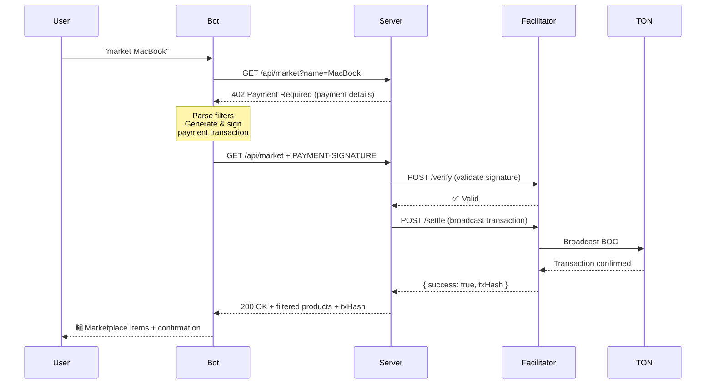

# Wisemanager - TON x402 Marketplace & Payment Bot

A modern **marketplace platform** with **Telegram bot integration**, powered by the **x402 protocol** on **TON blockchain**. Get instant access to weather data and browse tech products through Telegram, with seamless cryptocurrency payments using **BSA USD** stablecoin.

**Live Bot**: [@Wisemanagersbot](https://t.me/Wisemanagersbot)

**Built by**: [Your Name]  
**Based on**: BSA x TON x402 Protocol Template

---

## 🎯 Features

### 🤖 Telegram Bot (@Wisemanagersbot)
- **Natural Language Commands** - Chat naturally to browse and pay
- **Weather Data** - Real-time weather information (0.01 BSA USD)
- **Marketplace Browser** - Search and filter tech products with ease
- **Auto Payment** - Seamless TON blockchain micropayments
- **Smart Filters** - Search by name, price range, location
- **Instant Responses** - Get data in seconds

### 🛍️ Modern Marketplace
- **Two-Column Product Grid** - Optimized for desktop viewing
- **Advanced Filtering System**
  - Search by product name
  - Filter by location (Lausanne, Geneva, Zurich, Remote)
  - Price range selector
  - Condition filter (New, Like New, Used)
- **Responsive Design** - Works on desktop, tablet, and mobile
- **Clean Modern UI** - Inspired by Zeabur's design aesthetics
- **Real-time Updates** - Instant filter results

### 🏠 Landing Page
- **Minimalist Design** - Focus on what matters
- **Direct Bot Access** - One-click link to Telegram
- **Clear Value Proposition** - "Your Wisemanager"

---

## 🛠 Tech Stack

This is a **pnpm monorepo** built with:

- **[TypeScript](https://www.typescriptlang.org/)** - Type-safe development
- **[Next.js 15](https://nextjs.org/)** - API server with App Router
- **[TON SDK](https://github.com/ton-org/ton)** - Blockchain interactions (`@ton/ton`, `@ton/core`, `@ton/crypto`)
- **[Telegram Bot API](https://core.telegram.org/bots/api)** - Bot interface
- **[pnpm](https://pnpm.io/)** - Fast, disk space efficient package manager
- **BSA USD** - TEP-74 Jetton stablecoin on TON testnet

---

## 📁 Project Structure

```
bsa-sp-template-x402-2026/
├── packages/
│   ├── core/           # Protocol types, headers, encoding utilities
│   ├── client/         # x402Fetch - automated payment flow handler
│   ├── middleware/     # paymentGate - Next.js route protection
│   └── facilitator/    # Transaction verification & settlement
│
└── examples/
    ├── nextjs-server/  # API server & Web UI
    │   ├── app/
    │   │   ├── page.tsx                # Landing page (Wisemanager)
    │   │   ├── marketplace/
    │   │   │   ├── page.tsx           # Marketplace UI (2-column grid)
    │   │   │   └── demo/page.tsx      # API testing demo
    │   │   └── api/
    │   │       ├── weather/           # Weather endpoint (0.01 BSA USD)
    │   │       ├── market/            # Marketplace API (0.01 BSA USD)
    │   │       ├── joke/              # Joke endpoint (0.01 BSA USD)
    │   │       └── facilitator/       # Built-in facilitator
    │   ├── MARKETPLACE_GUIDE.md       # Marketplace documentation
    │   └── .env.local                 # Configuration
    │
    └── client-script/  # Payment client & Telegram bot
        ├── src/
        │   ├── telegram-bot.ts        # Bot with natural language support
        │   └── pay.ts                 # CLI payment script
        ├── start-bot.sh               # WSL startup script
        ├── start-bot.ps1              # PowerShell startup script
        ├── TELEGRAM_BOT_README.md     # Bot documentation
        ├── TROUBLESHOOTING.md         # Debugging guide
        ├── MARKET_FILTER_GUIDE.md     # Filter usage guide
        └── MARKET_FILTER_QUICK_REF.md # Quick reference
```

### 📦 Packages Overview

| Package | Description |
|---------|-------------|
| **@ton-x402/core** | Protocol types, header encoding/decoding, TON utilities |
| **@ton-x402/client** | `x402Fetch()` - Handles 402 → sign → retry flow automatically |
| **@ton-x402/middleware** | `paymentGate()` - Wraps Next.js routes with payment verification |
| **@ton-x402/facilitator** | Verification & settlement handlers for transactions |

---

## 🚀 Quick Start

### Prerequisites

**Required for everyone:**
- [Node.js](https://nodejs.org/) >= 18
- [pnpm](https://pnpm.io/) - Install: `npm i -g pnpm`
- [WSL](https://docs.microsoft.com/en-us/windows/wsl/install) (Windows users) - Required for running the bot
- [Toncenter API key](https://toncenter.com) - Free API key
- TON wallet address (for receiving payments)

**For Telegram Bot (optional but recommended):**
- Telegram Bot Token (create via [@BotFather](https://t.me/botfather))
- TON testnet wallet with 24-word mnemonic
- Testnet funds (TON for gas, BSA USD for payments)

---

### 1️⃣ Clone & Install

```bash
git clone git@github.com:DAVIDshenghuei/BSA---EPFL-Stablecoins-Payments-Hackathon.git
cd BSA---EPFL-Stablecoins-Payments-Hackathon
pnpm install
pnpm build
```

---

### 2️⃣ Configure Environment

```bash
cd examples/nextjs-server
cp .env.example .env.local
```

Edit `.env.local`:

```env
# Network configuration
TON_NETWORK=testnet

# Server wallet (receives payments) - ADDRESS ONLY, no private key needed
PAYMENT_ADDRESS=0QB_twkoUKiLUFxXIZ0n0hIo75-jOIVLALnp3GimcBPR0Sxa

# BSA USD Jetton master contract (testnet)
JETTON_MASTER_ADDRESS=kQCd6G7c_HUBkgwtmGzpdqvHIQoNkYOEE0kSWoc5v57hPPnW

# Facilitator endpoint (built-in)
FACILITATOR_URL=http://localhost:3000/api/facilitator

# TON RPC endpoint
TON_RPC_URL=https://testnet.toncenter.com/api/v2/jsonRPC
RPC_API_KEY=your_toncenter_api_key_here

# Client wallet (sends payments) - 24-WORD MNEMONIC
# Used by bot and CLI scripts to make payments
WALLET_MNEMONIC="word1 word2 word3 ... word24"
```

> **Important**: 
> - `PAYMENT_ADDRESS` = Where your server **receives** payments (public address only)
> - `WALLET_MNEMONIC` = Bot's wallet that **sends** payments (private key needed)

---

### 3️⃣ Get Testnet Funds

Your bot's wallet (from `WALLET_MNEMONIC`) needs:

**Testnet TON** (for gas):
```
Telegram: @testgiver_ton_bot
```

**Testnet BSA USD** (for payments):
```
Faucet: https://ton-x402-nextjs-server-dyvpwctew-hliosones-projects.vercel.app/
```

---

### 4️⃣ Start the API Server

From repo root:

```bash
pnpm dev
```

✅ Server running at: `http://localhost:3000`

---

### 5️⃣ Start the Telegram Bot

**Option A: Using WSL (Recommended)**

```bash
cd examples/client-script
bash start-bot.sh
```

**Option B: Using PowerShell**

```powershell
cd examples/client-script
.\start-bot.ps1
```

**Option C: Direct command**

```bash
cd examples/client-script
npx tsx --env-file=../nextjs-server/.env.local src/telegram-bot.ts
```

You should see:

```
🤖 Starting Telegram Bot...
📱 Bot Token: 8449323987...
✅ Bot connected: @YourBotName
👤 Bot name: YourBot
🔄 Listening for messages...
```

---

### 6️⃣ Test the Bot

1. Open your bot in Telegram: `https://t.me/YourBotName`
2. Send `/start` to see the welcome message
3. Send `weather` to trigger a payment and get weather data

**Expected flow:**

```
You: weather

Bot: ⏳ Fetching weather data and processing payment...
     Please wait...

Bot: 🌤️ Weather Data
     
     📍 Location: Lausanne, Switzerland
     🌡️ Temperature: 22°C
     ☁️ Conditions: Partly cloudy
     💧 Humidity: 45%
     🕐 Time: 3/21/2026, 8:36:07 PM
     
     ✅ Payment Confirmed
     🔗 Transaction Hash: 81c052bd873ab925c303daf2d07f32973452747fd4a7c2f445d3e38887476d7c
     🌐 Network: testnet
```

---

## 🌐 Web Interface

### Landing Page (`http://localhost:3000`)

**Minimalist Design** featuring:
- Large "Your Wisemanager" headline with gradient effect
- Direct link to Telegram bot
- Clean, centered layout
- Mobile responsive

### Marketplace (`http://localhost:3000/marketplace`)

**Modern eBay-style marketplace** with:

**Layout:**
- Left sidebar with filters (320px width)
- Two-column product grid
- Large product cards with detailed information

**Features:**
- 🔍 **Search** - Find products by name or tags
- 📍 **Location Filter** - Lausanne, Geneva, Zurich, Remote
- 💰 **Price Range** - Set min/max price (vertical inputs)
- 📦 **Condition** - New, Like New, Used
- 🔄 **Sort Options** - Newest, Price (Low/High), Trust Score

**Product Cards Display:**
- Product image placeholder (280px height)
- Product name and condition badge
- Large price display
- Seller info with trust score
- Location and delivery speed
- Category tags
- "View Details" button

**Responsive:**
- Desktop: 2-column grid
- Mobile: Single column with stacked filters

---

## 💬 Bot Commands

### Basic Commands
| Command | Description |
|---------|-------------|
| `/start` or `start` | Welcome message and bot introduction |
| `/help` or `help` | Detailed usage instructions |
| `weather` or `/weather` | Get real-time weather data (0.01 BSA USD) |

### Marketplace Commands

**Basic Search:**
```
market                    # Show all products
market MacBook           # Search for MacBook
```

**Filter by Price:**
```
market price 500-700     # Products between $500-$700
market 1000-1500         # Alternative syntax
```

**Filter by Location:**
```
market in Lausanne       # Products in Lausanne
market location Geneva   # Alternative syntax
```

**Combined Filters:**
```
market laptop price 600-800           # Laptops between $600-$800
market MacBook in Zurich              # MacBooks in Zurich
market Dell price 500-600             # Dell products, $500-$600
market laptop price 1000-2000 in Geneva  # All filters combined
```

### Natural Language Support

The bot understands natural language! You can type commands in various ways:
- `market MacBook` or `market: MacBook`
- `market price 500-700` or `market $500-$700`
- `market in Lausanne` or `market at Lausanne`

---

## 🔄 How It Works

### Complete User Journey

1. **User opens bot** → `https://t.me/Wisemanagersbot`
2. **User types command** → `market MacBook price 1000-2000`
3. **Bot processes** → Parses natural language command
4. **Bot requests API** → `GET /api/market?name=MacBook&price=1000-2000`
5. **Server returns 402** → Payment required with TON address
6. **Bot signs payment** → Creates signed transaction (offline)
7. **Bot retries request** → Includes signed payment
8. **Facilitator verifies** → Validates signature
9. **Transaction broadcasts** → Sent to TON blockchain
10. **Server confirms** → Payment verified on-chain
11. **Data returned** → Filtered marketplace items
12. **User receives** → Beautiful formatted response with tx hash

### Architecture Overview

```
┌─────────────┐      ┌─────────────┐      ┌─────────────┐      ┌─────────────┐
│   Telegram  │      │     Bot     │      │ Next.js     │      │    TON      │
│    User     │◄────►│ (Client)    │◄────►│   Server    │◄────►│  Blockchain │
│             │      │             │      │             │      │  (Testnet)  │
└─────────────┘      └─────────────┘      └─────────────┘      └─────────────┘
                            │                      │
                            │    Facilitator       │
                            └──────────────────────┘
                              (Verify & Settle)
```

### Payment Flow



---

## 🔧 Advanced Usage

### Testing with CLI (Without Bot)

```bash
# Test weather endpoint
pnpm dev:client

# Test joke endpoint
pnpm dev:client:joke
```

### Natural Language Examples

**Bot Command Parsing:**
```
User input: "market laptop price 600-800 in Zurich"
Bot extracts: { name: "laptop", price: "600-800", location: "Zurich" }
API call: /api/market?name=laptop&price=600-800&location=Zurich
```

**Flexible Syntax:**
- `market MacBook` → name filter
- `market price 500-700` → price filter
- `market $500-$700` → price filter (alternative)
- `market in Lausanne` → location filter
- `market location Geneva` → location filter (alternative)
- `market laptop 600-800 Zurich` → all filters combined

### Implementation Highlights

**Smart Command Parsing:**
```typescript
// Bot intelligently detects filter types
if (value.startsWith('$') || value.includes('-')) {
  filters.price = value.replace(/\$/g, '');
} else if (['lausanne', 'geneva', 'zurich'].includes(value.toLowerCase())) {
  filters.location = value;
} else {
  filters.name = value;
}
```

**Server-side Filtering:**
```typescript
// Case-insensitive name search
items.filter(item => item.item.toLowerCase().includes(name.toLowerCase()));

// Price range support
const [min, max] = price.split('-').map(parseFloat);
items.filter(item => item.price_usd >= min && item.price_usd <= max);

// Location matching
items.filter(item => item.location.toLowerCase().includes(location.toLowerCase()));
```

### Adding New Payment-Protected Routes

**Server side** (`app/api/my-endpoint/route.ts`):

```typescript
import { paymentGate } from "@ton-x402/middleware";
import { getPaymentConfig } from "../../../lib/payment-config";

const handler = (_request: Request) => {
    return Response.json({ 
        message: "This is premium content!",
        secret: "Only available after payment"
    });
};

export const GET = paymentGate(handler, {
    config: getPaymentConfig({
        amount: "10000000",  // 0.01 BSA USD (9 decimals)
        asset: process.env.JETTON_MASTER_ADDRESS,
        description: "Premium content (0.01 BSA USD)",
        decimals: 9,
    }),
});
```

**Add bot command** (in `telegram-bot.ts`):

```typescript
if (text === "premium" || text === "/premium") {
    await sendMessage(chatId, "⏳ Fetching premium content...");
    
    const result = await getDataFromEndpoint("http://localhost:3000/api/my-endpoint");
    // Handle response...
}
```

---

## 📋 Available Scripts

Run from **repo root**:

| Command | Description |
|---------|-------------|
| `pnpm install` | Install all dependencies |
| `pnpm build` | Build all packages |
| `pnpm dev` | Start Next.js server (`localhost:3000`) |
| `pnpm dev:bot` | Start Telegram bot |
| `pnpm dev:client` | Test CLI payment (weather) |
| `pnpm dev:client:joke` | Test CLI payment (joke) |
| `pnpm address` | Show wallet address formats |
| `pnpm clean` | Delete build output |
| `pnpm typecheck` | Run TypeScript checks |

---

## 🐛 Troubleshooting

### Bot Not Responding

1. Check if bot is running: `ps aux | grep telegram-bot`
2. Verify server is running: `curl http://localhost:3000`
3. Check bot token is correct in code
4. View logs in terminal where bot is running

### Duplicate Messages

If receiving multiple replies:
- **Cause**: Multiple bot instances running
- **Fix**: Run `pkill -f telegram-bot` then restart

### Payment Failed

- Verify wallet has sufficient TON (for gas)
- Check wallet has BSA USD tokens
- Confirm `PAYMENT_ADDRESS` is correct
- Ensure facilitator service is running

See `examples/client-script/TROUBLESHOOTING.md` for detailed troubleshooting.

---

## 🌐 API Endpoints

### Payment-Protected Routes

| Endpoint | Price | Description | Filters |
|----------|-------|-------------|---------|
| `GET /api/weather` | 0.01 BSA USD | Real-time weather data for Lausanne | - |
| `GET /api/market` | 0.01 BSA USD | Marketplace product listings | `name`, `price`, `location` |
| `GET /api/joke` | 0.01 BSA USD | Random developer joke | - |

### Market API Query Parameters

**Filter by Name:**
```
GET /api/market?name=MacBook
```

**Filter by Price Range:**
```
GET /api/market?price=500-700
```

**Filter by Location:**
```
GET /api/market?location=Lausanne
```

**Combined Filters:**
```
GET /api/market?name=laptop&price=600-800&location=Geneva
```

**Response Format:**
```json
{
  "success": true,
  "total_items": 3,
  "filters_applied": {
    "name": "MacBook",
    "price": "500-700",
    "location": "Lausanne"
  },
  "items": [
    {
      "item": "MacBook Pro 14\" M3 Pro",
      "price_usd": 1899,
      "seller": "TechStore",
      "trust_score": 98,
      "location": "Lausanne",
      "condition": "New",
      "delivery_speed": "1-2 days",
      "tags": ["laptop", "apple", "m3"]
    }
  ],
  "timestamp": "2026-03-21T..."
}
```

### Facilitator Endpoints

| Endpoint | Method | Purpose |
|----------|--------|---------|
| `/api/facilitator/verify` | POST | Validate signed BOC offline |
| `/api/facilitator/settle` | POST | Broadcast transaction and confirm |

---

## 🔐 Security Notes

⚠️ **Important Security Practices:**

- **Never commit** `.env.local` to version control
- Keep your **Bot Token** secure
- Protect your **wallet mnemonic** (never share it)
- Use environment variables for all sensitive data
- In production, deploy facilitator as separate service
- Use webhooks instead of polling in production

---

## 📚 Documentation

- **Main README**: This file
- **Marketplace Guide**: `examples/nextjs-server/MARKETPLACE_GUIDE.md` - Complete marketplace documentation
- **Telegram Bot**: `examples/client-script/TELEGRAM_BOT_README.md` - Bot setup and usage
- **Market Filters**: `examples/client-script/MARKET_FILTER_GUIDE.md` - Detailed filter guide
- **Quick Reference**: `examples/client-script/MARKET_FILTER_QUICK_REF.md` - Command cheat sheet
- **Troubleshooting**: `examples/client-script/TROUBLESHOOTING.md` - Debug guide
- **Translation Summary**: `examples/client-script/TRANSLATION_SUMMARY.md` - Localization info
- **Market API**: `examples/nextjs-server/app/api/market/README.md` - API documentation

---

## 🔗 Useful Resources

### TON Ecosystem
- [TON Documentation](https://docs.ton.org)
- [Toncenter API](https://toncenter.com) - RPC endpoint & API key
- [Tonkeeper Wallet](https://tonkeeper.com) - Testnet-enabled wallet
- [TEP-74 Jetton Standard](https://github.com/ton-blockchain/TEPs/blob/master/text/0074-jettons-standard.md)

### Testnet Faucets
- **TON**: [@testgiver_ton_bot](https://t.me/testgiver_ton_bot)
- **BSA USD**: [Faucet](https://ton-x402-nextjs-server-dyvpwctew-hliosones-projects.vercel.app/)

### Telegram
- [Bot API Documentation](https://core.telegram.org/bots/api)
- [BotFather](https://t.me/botfather) - Create & manage bots
- [Bot Updates](https://core.telegram.org/bots/api#getting-updates) - Polling vs Webhooks

### BSA
- [BSA Website](https://bsaepfl.ch)
- [BSA GitHub](https://github.com/bsaepfl)

---

## 🎯 What is x402?

**x402** is an open protocol for **machine-to-machine HTTP micropayments**:

1. **Client requests** a protected resource
2. **Server responds** with `402 Payment Required` + payment instructions
3. **Client signs** a payment transaction locally (offline)
4. **Client retries** with signed transaction attached
5. **Facilitator verifies** signature and broadcasts to blockchain
6. **Server unlocks** resource after payment confirmation

**Key Benefits:**
- ✅ No wallet popups or browser extensions
- ✅ No user interaction required
- ✅ Perfect for APIs and automation
- ✅ Cryptographically secure
- ✅ On-chain settlement with proof

---

## 📊 Environment Variables

| Variable | Required | Description |
|----------|----------|-------------|
| `TON_NETWORK` | ✅ | `testnet` or `mainnet` |
| `PAYMENT_ADDRESS` | ✅ | Server wallet (receives payments) |
| `JETTON_MASTER_ADDRESS` | ✅ | BSA USD contract address |
| `FACILITATOR_URL` | ⚠️ | Facilitator endpoint (defaults to built-in) |
| `TON_RPC_URL` | ⚠️ | Toncenter RPC (defaults to testnet) |
| `RPC_API_KEY` | ⚠️ | API key (recommended to avoid rate limits) |
| `WALLET_MNEMONIC` | ✅* | Bot/client wallet (24 words) - *only for bot/CLI |

---

## 🚀 Production Deployment

### Recommended Architecture

```
┌──────────────┐     ┌──────────────┐     ┌──────────────┐
│  Telegram    │────►│   Bot Server │────►│  API Server  │
│  (Frontend)  │     │  (Railway)   │     │  (Vercel)    │
└──────────────┘     └──────────────┘     └──────────────┘
                              │                    │
                              │                    │
                              ▼                    ▼
                     ┌──────────────┐     ┌──────────────┐
                     │ Facilitator  │     │ TON Mainnet  │
                     │  (Railway)   │     │              │
                     └──────────────┘     └──────────────┘
```

### Deployment Tips

1. **API Server** → Vercel, Netlify, or Railway
2. **Bot** → Railway (24/7 uptime needed)
3. **Facilitator** → Separate service (security)
4. **Use Webhooks** instead of polling for bot
5. **Switch to mainnet** for production
6. **Secure environment variables** in deployment platform

---

## 📄 License

MIT

**Happy Hacking! 🚀**
